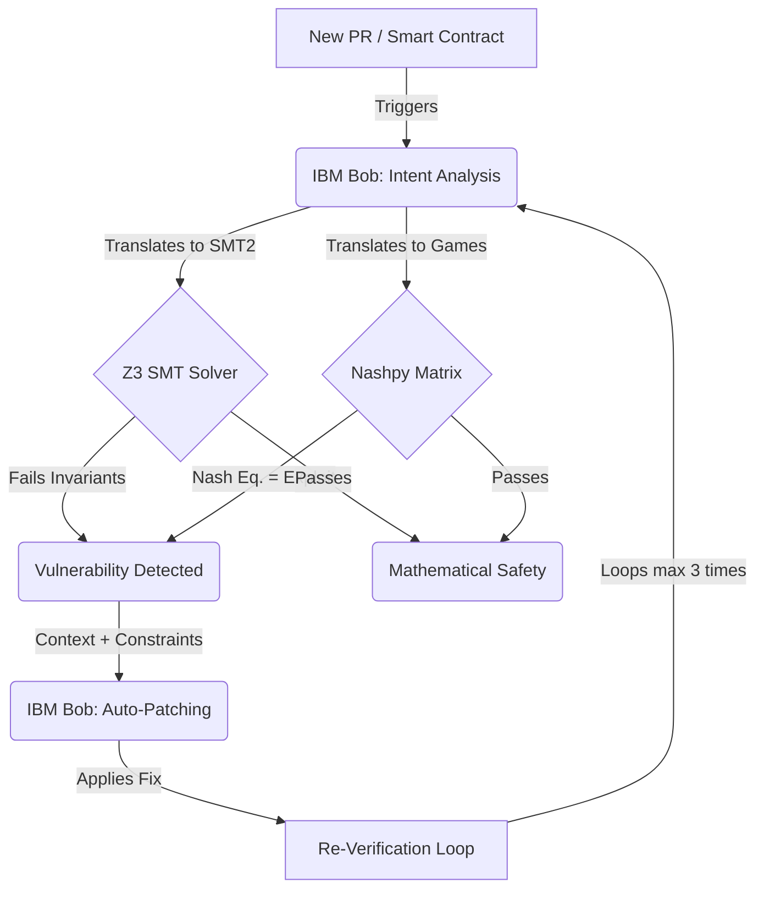

<div align="center">
  
  
  
  <br />
  <br />
  <h1>Gandy: Neurosymbolic Smart Contract Verification</h1>
  <p><strong>A CI/CD platform that verifies the economics of your smart contracts—not just the code. Catch billion-dollar logic exploits instantly before they are merged.</strong></p>
  <br />
</div>

---

## 🚀 The $182M Problem (And The Solution)
Most Web3 security tools check for known bugs like reentrancy. But the biggest hacks in DeFi (like the $182M Beanstalk exploit) aren't bugs in the code—they are flaws in the **mechanism design**. They exploit the game theory of the protocol.

**Gandy** solves this by using a neurosymbolic loop:
1. **IBM Bob (Watsonx)** reads your PR and translates economic intent into formal logic.
2. **Z3 SMT Solver** mathematically proves invariants.
3. **Nashpy** models the rational behavior of attackers.

Instead of just checking code, Gandy mathematically proves whether an exploit is possible given rational attacker behavior, and auto-generates the patch.

## 🌐 Live Demos
- **Landing Page & Pricing:** [https://fawazishola.github.io/Gandy/landingpage.html](https://fawazishola.github.io/Gandy/landingpage.html)
- **Interactive Web App (Gandy Platform):** [https://fawazishola.github.io/Gandy/Gandy.html](https://fawazishola.github.io/Gandy/Gandy.html)

## 🧠 Proven Against $2.19B+ in Real-World Exploits
To prove Gandy works, we ran IBM Bob against a catalogue of **15 massive real-world DeFi hacks**, accounting for over **$2.19 Billion** in historical losses. 

**The Result: 87% Detection Rate (13/15 Caught)**
Gandy successfully detected and auto-patched catastrophic vulnerabilities including the Mango Markets Oracle manipulation, the Euler Finance liquidation attack, and the Ronin Bridge key compromise.

### Case Study: The $182M Beanstalk Flash-Loan
As our primary benchmark, we fed Bob the **Beanstalk Governance contract** exactly as it was *before* the devastating $182M flash-loan attack.
- Gandy's neurosymbolic loop caught the vulnerability instantly.
- The **Nashpy** layer mapped the Nash equilibrium dominance of the flash loan voting attack.
- IBM Bob generated a secure, mathematically proven patch blocking single-block execution.

> 📚 **Read the Full Exploit Report:** Check out `docs/EXPLOIT_DETECTION_REPORT.md` to see the full breakdown of all 15 exploits, Z3 math constraints, and IBM Bob's live detection traces.

## 🏗️ How It Works (Architecture)
Gandy operates via an autonomous 8-stage neurosymbolic loop, blending the semantic understanding of neural AI (IBM Bob) with the absolute certainty of symbolic logic (Z3 & Nashpy).



### Leveraging Bob's Strengths in the Loop
1. **Semantic Translation (The Missing Link)**: Pure mathematical solvers like Z3 can't read Solidity or human intent. IBM Bob bridges this gap by acting as a high-fidelity translator, reading the smart contract logic and writing strict formal `SMT2` constraints and game-theory payoff matrices.
2. **Context-Aware Patching**: When Z3 or Nashpy flags a vulnerability (like a 50%+ dominance in an attack vector), Bob isn't just told "it failed". Bob receives the exact mathematical counter-example. Leveraging its LLM reasoning, Bob generates a hyper-targeted patch to close the economic exploit.
3. **Iterative Learning**: Bob sits at the center of the CI/CD feedback loop, continuously re-generating and re-evaluating the contract until mathematical safety is achieved.

## 🤖 Built by Bob: Our AI Co-Founder
To prove the capability of IBM Bob, we didn't just use it in the architecture—**we used IBM Bob to build the entire backend system.** 
Bob served as our Lead AI Engineer, logging over **150+ CLI interactions** to architect, build, and relentlessly attack the Gandy verification framework.

**How we used Bob across the entire development lifecycle:**
- **Core Architecture & Scaffolding**: Bob single-handedly wrote `core/orchestrator.py` (the 8-stage verification loop), `bob_bridge.py` (the sub-process CLI controller), and `parser.py` (the multi-format SMT/JSON regex parser).
- **Mathematical Frameworks Implementation**: Bob implemented all 8 backend verification engines entirely from scratch, including the **Z3/Algebraic** bindings, the **SymPy Differential** solver, the **Monte Carlo Stochastic** engine, and the **Nashpy** game theory calculators.
- **Adversarial Security Testing (Red Teaming)**: Bob acted as a malicious red-team agent through 4 autonomous attack workflows, discovering **40 critical vulnerabilities** in our own mathematical pipelines (e.g., division by zero in CVaR stochastic calculations, unhandled edge cases in Nash equilibrium matrices, and unchecked payload structures).
- **Automated Hardening (Blue Teaming)**: After discovering the 40 vulnerabilities, Bob switched contexts to auto-generate the exact defensive patches, rewriting `parser.py` and `core/types.py` with defensive type-checking and dictionary validation to protect the orchestration layer.
- **Frontend Auditing**: Bob conducted a brutally honest code review (`FRONTEND_REVIEW.md`), diagnosing the disconnect between our React prototypes and the real Python backend, providing exact architecture maps (WebSocket/SSE) for real-time streaming integration.

*(Check `docs/architecture/TECHNICAL_SUMMARY.md` and our tracked Bob task files for the full historical log of Bob's contributions to the codebase).*

## 💻 Quick Start & Installation

### 1. Environment Setup
```bash
python3 -m venv venv
source venv/bin/activate
pip install -r requirements.txt
```

### 2. Install IBM Bob CLI
Gandy is powered by IBM Bob. (Requires Node.js 22.15+)
```bash
curl -fsSL https://bob.ibm.com/download/bobshell.sh | bash -s -- --pm npm
```

### 3. Run the Hackathon Exploit Test
Watch the neurosymbolic loop in action on the Beanstalk case study:
```bash
python run_exploit_tests.py
```

## 📂 Repository Structure
- `api/`: FastAPI server handling verification requests.
- `core/`: The neurosymbolic orchestrator engine tying Bob, Z3, and Nashpy together.
- `frontend/`: React dashboard showing the live PR CI/CD simulation and Interactive Bob session.
- `contracts/`: Smart contract sources for the test cases.
- `artifacts/`: JSON data dumps, game theory matrices, and SMT constraints.
- `docs/`: In-depth documentation, architecture specs, and historical research traces.

## 🔮 What's Next (Roadmap)
- **Live GitHub App Integration**: Block PRs automatically based on Bob's verification result.
- **Support for More Solvers**: Expanding beyond Z3 to include cvc5 for non-linear arithmetic.
- **Enterprise UI**: Adding robust multi-repo portfolio views for institutional risk teams.


---
*Built with ❤️ for the IBM Bob Hackathon on lablab.ai*
